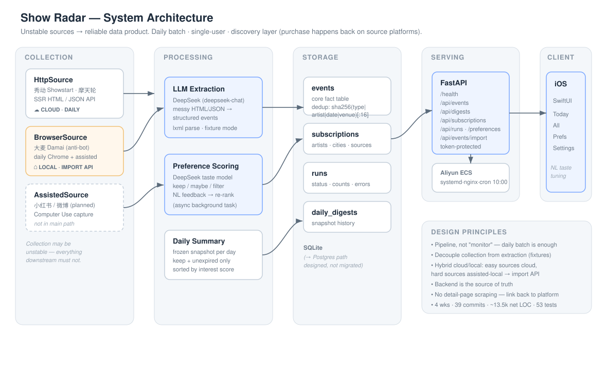
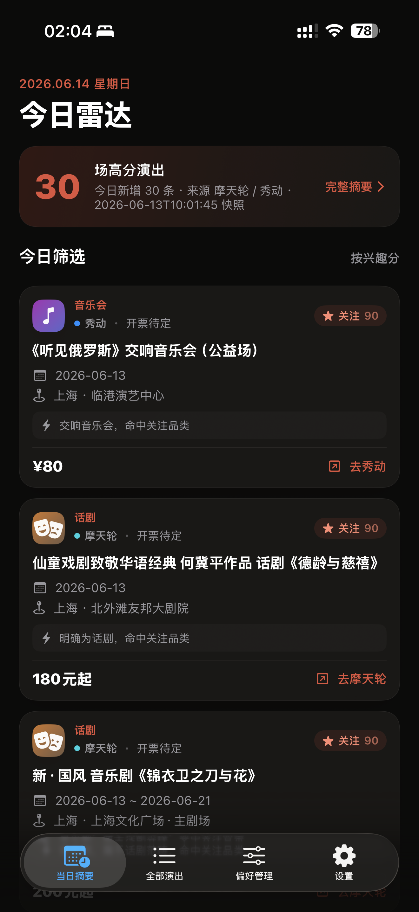
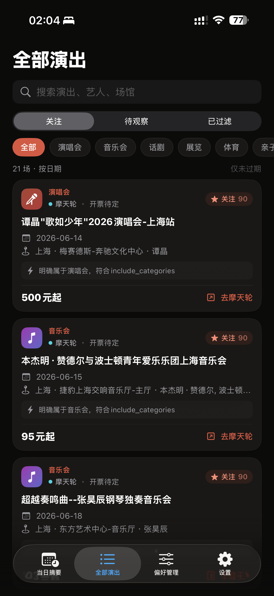
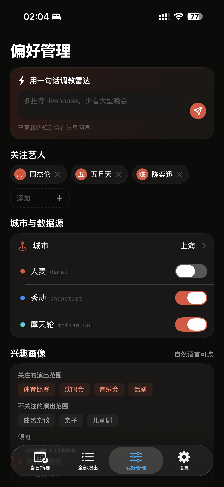
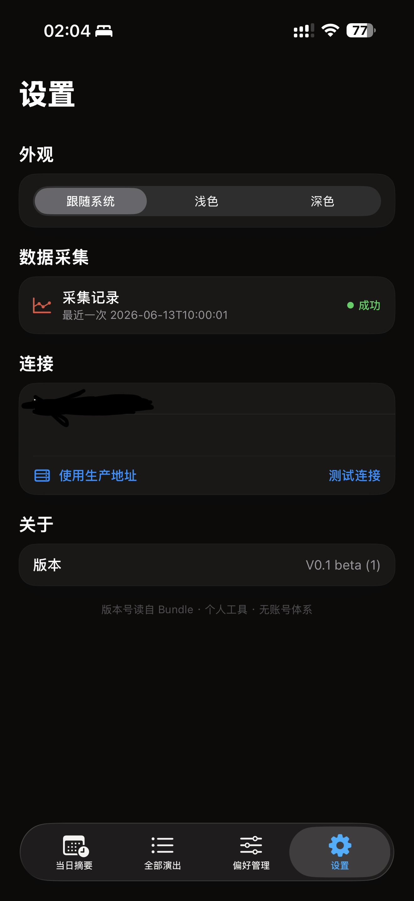

# Show Radar / 演出雷达

一个个人演出情报雷达：从多个票务平台抓取演出信息，用 LLM 结构化、去重、按个人偏好打分，再通过 iOS App 和每日摘要展示“当前最值得关注、且还没过期”的演出。

这是一个产品经理的 vibe coding 项目。它的重点不是“写了一个爬虫”，而是把一个真实个人需求拆成数据管道、服务端、偏好系统和移动端消费体验，并用 PRD 约束设计 AI / coding AI 的协作边界。

> 当前状态：项目暂告段落。主链路已经跑通，剩余小 bug 和新增源暂不继续追。

## Why It Matters

- **真实需求**：演出信息散落在大麦、秀动、摩天轮等平台，人工刷很容易漏掉。
- **产品闭环**：采集、抽取、去重、评分、摘要、iOS 查看、自然语言校准偏好都已跑通。
- **工程取舍**：稳定源上云自动跑，困难源留在本机登录态环境辅助采集，再统一同步入库。
- **AI 协作经验**：项目中曾出现设计 agent 设计未实现功能、coding agent 跟着实现导致 App 崩掉的情况；后续通过回滚和 PRD 明确 4 Tab、无详情页、无推送、无假按钮等边界，避免跨 agent 乱发挥。

## Architecture



> 采集层允许不稳定，但采集之后的抽取、存储、摘要、客户端必须稳定。稳定源云端每日跑，困难源本机辅助采集再走 import API 同步。

## Product Snapshot

```text
多个票务平台 / 本机辅助采集
        ↓
原始页面 / JSON / 可见页文本
        ↓
LLM 抽取标准化事件
        ↓
SQLite 去重入库
        ↓
DeepSeek 偏好评分 / 分类
        ↓
结构化每日摘要 + FastAPI
        ↓
iOS App / Markdown digest / macOS 通知
```

核心体验：

- 每天打开 iOS App，看一眼今日雷达。
- 浏览全部未过期演出，按分类、兴趣决策、搜索筛选。
- 用自然语言调整偏好，例如“多推荐 livehouse，不想看亲子剧”“降低话剧优先级，增加艺人五月天”。
- 查看采集运行记录，必要时手动触发一次采集。

## Screenshots

| 当日摘要 | 全部演出 | 偏好管理 | 设置 |
|---|---|---|---|
|  |  |  |  |

## Current Capabilities

### Data Sources

| Source | Status | Strategy |
|---|---|---|
| 秀动 Showstart | 云端稳定运行 | requests + cityCode |
| 摩天轮 | 云端稳定运行 | requests + JSON API |
| 大麦 | 本机辅助采集 | 日常 Chrome / 登录态 / 人工或 Computer Use 辅助 |

### Backend

- FastAPI 服务，提供事件、摘要、订阅、偏好、运行记录 API。
- SQLite 存储事件、订阅、偏好画像、运行记录和摘要快照。
- 每次采集后生成结构化 `summary_YYYY-MM-DD.json`，冻结当日摘要事件对象，避免后续数据库变化改写历史摘要。
- `date_from=<today>` 保留 `event_date IS NULL` 的“日期待定”演出，避免仍有效的待定活动被过滤。
- 自然语言偏好反馈同步更新 profile，历史重打分进入后台任务，避免 App 等待超时。

### iOS App

SwiftUI 客户端，当前范围收敛为 4 个 Tab：

1. **当日摘要**：展示后端冻结的结构化今日 feed。
2. **全部演出**：展示未过期 / 待定演出，支持搜索和筛选。
3. **偏好管理**：自然语言反馈、关注艺人、城市、数据源开关。
4. **设置**：外观、连接、采集记录、版本信息。

产品边界：

- 不做多用户和账号系统。
- 不做演出详情页，卡片直接跳第三方购票链接。
- 不做推送通知，因此不放通知开关假 UI。
- App 不自行推断业务逻辑，后端是事实源。

## Key Product Decisions

### 1. Start From Easy Sources

先做票务平台，不直接挑战社交媒体全站搜索。第一目标是尽快拿到“它真的能发现并提醒我”的闭环，再逐步加难。

### 2. Separate Fetching From Extraction

用 fixture 模式先验证 LLM 抽取链路，避免一开始被反爬、登录态、网络环境卡死。抓取可以不稳定，但抽取、存储、摘要和客户端必须稳定。

### 3. Treat It As A Data Pipeline

这个项目不是实时监控系统，而是每日批处理的信息管道。每天跑一次足够满足需求，也显著降低了调度、通知节流和系统复杂度。

### 4. Cut Low-ROI Detail Pages

自动抓详情页并二次抽取字段的成本高、稳定性低。项目保留 `purchase_url`，把原平台作为购票决策层，Show Radar 只做发现层。

### 5. Use PRD As An AI Collaboration Contract

`PRD-演出雷达.md` 是写给设计 AI 和 coding AI 的共同事实源。它不仅写“要做什么”，也写“不做什么”，避免设计稿脑补未实现功能，再把错误传给 coding agent。

## Local Development

### Install

```bash
python3 -m venv venv
./venv/bin/pip install -r requirements.txt -r requirements-dev.txt
```

Create `.env`:

```bash
DEEPSEEK_API_KEY=sk-xxx

# Optional. Preference parsing and scoring reuse DeepSeek by default.
SHOW_TRACE_PREFERENCES_LLM=1
SHOW_TRACE_PREFERENCES_MODEL=deepseek-chat
```

### Run The Worker

```bash
# Full local worker, mainly for debugging.
./venv/bin/python main.py

# Stable reference path: bypass live fetching, validate extraction and pipeline.
./venv/bin/python main.py --fixture

# Prepare a Chrome profile for difficult sources if needed.
./venv/bin/python main.py --init-profile
```

Outputs:

- `data/digests/digest_YYYY-MM-DD.md` - Markdown digest.
- `data/digests/summary_YYYY-MM-DD.json` - structured daily summary snapshot.
- `data/show_trace.db` - local SQLite database.

### Run The API

```bash
./venv/bin/uvicorn app.api:app --reload
```

Useful endpoints:

| Endpoint | Purpose |
|---|---|
| `GET /health` | health check |
| `GET /api/events` | event list, supports filters like `interest_decision`, `date_from`, `limit` |
| `GET /api/digests/today` | latest structured daily summary |
| `GET /api/digests` | historical markdown digest list, kept for compatibility |
| `GET /api/subscriptions` / `PUT /api/subscriptions` | read / update subscription config |
| `GET /api/preferences` | read preference profile |
| `POST /api/preferences/feedback` | natural-language preference feedback |
| `POST /api/events/import` | import structured events from local assisted collection |
| `GET /api/runs` / `POST /api/runs` | run history / trigger a run |
| `GET /docs` | OpenAPI docs |

If `API_TOKEN` is set, all `/api/*` endpoints require:

```bash
Authorization: Bearer <token>
```

`/health` stays public for deployment health checks.

Trigger a fixture run:

```bash
curl -X POST http://127.0.0.1:8000/api/runs \
  -H 'Content-Type: application/json' \
  -d '{"fixture": true, "notify": false}'
```

Send natural-language preference feedback:

```bash
curl -X POST http://127.0.0.1:8000/api/preferences/feedback \
  -H 'Authorization: Bearer <token>' \
  -H 'Content-Type: application/json' \
  -d '{
    "feedback": "多推荐 livehouse，不想看亲子剧，增加艺人五月天",
    "rescore_existing": true,
    "rescore_limit": 500
  }'
```

## Local Assisted Sources

大麦 / 小红书这类困难源不再追求纯云端 headless 自动化。推荐路径是：

1. 在本机日常 Chrome / Computer Use / 人工接管中获取信息。
2. 整理成标准事件 JSON，放入 `data/local_inbox/`。
3. 调用导入脚本同步到云端或本地 API。

```bash
SHOW_TRACE_API_BASE_URL=http://<server-ip> \
API_TOKEN=<cloud-api-token> \
./venv/bin/python scripts/sync_local_events.py data/local_inbox/2026-06-03-damai-visible.json
```

JSON 可以是事件数组，也可以是：

```json
{
  "trigger": "local-computer-use",
  "notify": false,
  "events": [
    {
      "type": "concert",
      "title": "示例演出",
      "artist": "周杰伦",
      "city": "上海",
      "venue": "示例场馆",
      "event_date": "2026-08-08",
      "source": "local-computer-use",
      "discovered_via": "本机 Chrome / Computer Use"
    }
  ]
}
```

导入接口复用事件去重逻辑：同一事件重复上传会更新易变字段，不会重复入库。

## iOS App

The iOS client lives in:

```text
ios/ShowTraceApp/
```

Notes:

- SwiftUI, target iOS 17.
- API token is stored in Keychain.
- App icon and `V0.1 beta` versioning are configured.
- Device build and final manual verification are intentionally kept outside the automated backend test flow.

## Project Structure

```text
main.py                    CLI entrypoint for the daily pipeline
app/
  api.py                   FastAPI endpoints
  database.py              API query helpers
  pipeline.py              subscription -> fetch -> extract -> upsert -> summarize
  preferences.py           preference feedback parsing and scoring helpers
  summary.py               structured daily summary snapshots
db.py                      SQLite schema and persistence helpers
extractor.py               LLM extraction with DeepSeek
sources/
  base.py                  source abstraction and fetch cache helpers
  damai.py                 difficult source, kept for local / browser-assisted path
  showstart.py             Showstart source
  motianlun.py             Motianlun source
notifiers/
  markdown.py              Markdown digest output
  macos.py                 macOS local notification
scripts/
  sync_local_events.py     import locally assisted events
  backfill_interest_scores.py
ios/ShowTraceApp/          SwiftUI iOS client
data/                      runtime data, mostly gitignored
  fixtures/                stable fixture samples, committed
  local_inbox/             local assisted-source JSON inbox, gitignored
PRD-演出雷达.md             product spec for design AI and coding AI
ARCHITECTURE.md            architecture notes
DEPLOYMENT.md              ECS deployment guide
LOCAL_AUTOMATION.md        local assisted-source workflow
项目复盘-演出雷达.md          project retrospective
```

## Tests

```bash
./venv/bin/pytest
```

The latest project closeout had backend tests passing and iOS type-check / simulator debug build passing. Real-device iOS verification is manual by design.

## Status And Next Steps

Current status: paused.

Completed:

- Core data pipeline.
- Cloud deployment for stable sources.
- FastAPI read / write API.
- Preference scoring and natural-language feedback.
- Structured daily summary feed.
- SwiftUI iOS client.
- App icon and beta versioning.

Known but intentionally not pursued for now:

- More data sources.
- More robust difficult-source automation.
- Additional iOS polish and small bugs.
- Public productization beyond a personal demo.

